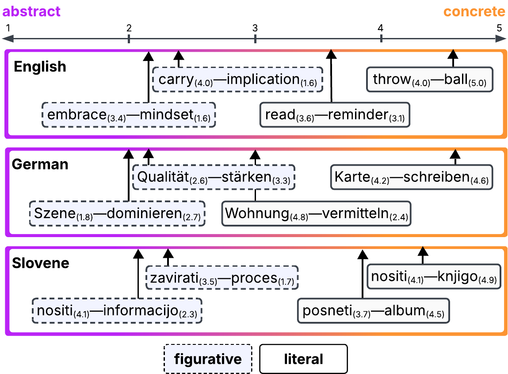
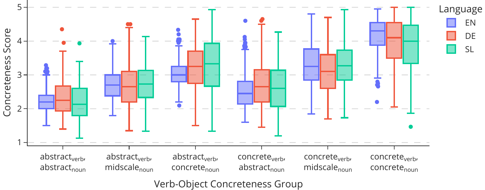
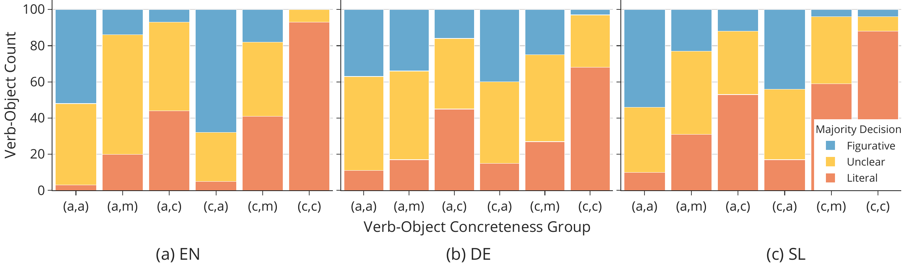

# Multilingual Concreteness Norms for Verb-Object Expressions

Data and code for the [TACL 2026 paper](https://doi.org/10.1162/tacl.a.703).

How concrete is *buy oil* next to *rebuild civilization*? And does that concreteness line up with whether *carry uncertainty* reads as figurative and *convince student* as literal? We asked native speakers of English, German and Slovene.

- [Overview](#overview)
- [Insights](#insights)
- [Data](#data)
- [Repository structure](#repository-structure)
- [Citation](#citation)

## Overview

<div align="center">
  
</div>
Concreteness is how directly a word points at something you can see, touch or hear, and it is an important variable in many disciplines (linguistics, psychology, robotics and more).

But norms almost always rate words on their own. We rated them in combination.

We asked native speakers to judge 5,814 verb-object expressions. Instead of a 1 to 5 scale, they saw four at a time and picked the most and the least concrete.

For a subset we also collected figurative or literal labels, each with an example sentence. Slovene had no concreteness norms at all, so we built the first word-level ratings for the language along the way.

Ratings of this quality are slow and expensive to collect, so we used automatic methods to extend the set to over 430,000 expressions.

## Insights

<div align="center">
  
</div>

Both *throw ball* and *carry implication* start with something you can picture yourself doing. Only one of them stays that way. Whatever the verb suggests, it is the object that decides where an expression ends up: you can hold a ball, you cannot hold an implication.

<div align="center">
  
</div>

How concrete the two words are together also shapes how people read the expression. The more abstract the combination, the more often it is judged figurative rather than literal, and we see the same trend in all three languages.

## Data

**You can download the datasets here: [ims.uni-stuttgart.de/data/mudcat/multilingual-concreteness-vo](https://www.ims.uni-stuttgart.de/data/mudcat/multilingual-concreteness-vo/)**

The data is hosted there rather than in this repository. We want to share it responsibly: openly available to researchers, but harder for automated scrapers to collect. This lowers the risk of evaluation contamination while keeping the files easy to find and download.

What you get:

| Dataset | Languages | Contents |
| --- | --- | --- |
| Verb-object concreteness norms | EN, DE, SL | Ratings for 5,814 verb-object expressions |
| Word norms | SL | Word-level ratings for 798 verbs and nouns |
| Figurative judgments | EN, DE, SL | 1,800 expressions labelled figurative or literal, with 9,000 example sentences |
| Extrapolated ratings | EN, DE, SL | 431,262 automatically predicted ratings |

Files are TSV, and each folder has a README describing its columns. Annotator sociodemographic data is not part of this release.

## Repository structure

A snapshot of how the datasets were built, kept here for reference rather than as a package to install.

```
src/
  dataset_construction/    extracting verb-object pairs from web corpora
  best_worst_scaling/      generating tuples, scoring judgments
  extrapolation/           fine-tuning and LLM prompting
  analysis/                notebooks behind the paper's figures and tables
figures/
```

## Citation

If you use this code in your research, please use the following citation:

```bibtex
@article{knuples-etal-2026-concreteness,
    title     = {Literally Concrete or Figuratively Abstract? {M}ultilingual Concreteness Norms for Verb-Object Expressions},
    author    = {Knuple{\v{s}}, Urban and Frassinelli, Diego and Fraser, Alexander and {Schulte im Walde}, Sabine},
    journal   = {Transactions of the Association for Computational Linguistics},
    volume    = {14},
    pages     = {1205--1224},
    year      = {2026},
    doi       = {10.1162/tacl.a.703}
}
```
